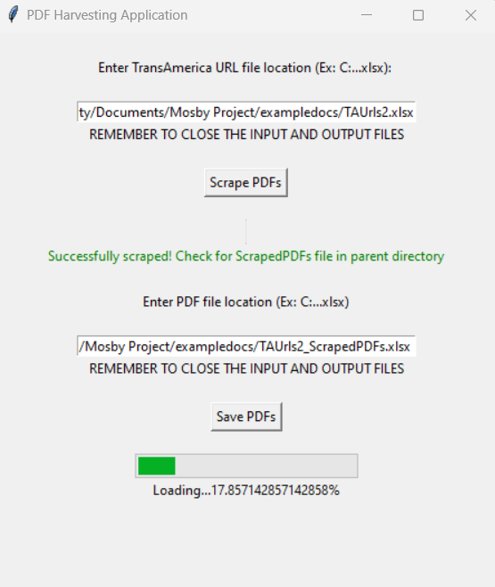

# PDF Harvesting Application
PDF Harvesting Application is a Python application that scrapes pdfs from TransAmerica and stores the pdfs into local root directory in organized manner with an accompanying excel file containing a file index.

## Built With
* [Python](https://www.python.org/): Python is a versatile and powerful programming language.  It is known for its readability, ease of use, and extensive library.  Given tasks involving data manipulation, GUI development, and file handling, Python was a suitable choice.
* [Tkinter](https://docs.python.org/3/library/tkinter.html): Tkinter is the standard GUI toolkit for Python.  It provides a simple way to create GUI applications and is well-suited for smaller projects.  It being included with most Python installations, makes it convenient for the end user.
* [pandas](https://pandas.pydata.org/): Pandas is used for data manipulation and analysis.  In this project, pandas simplifies tasks such as filterin, aggregating, and transforming data.  Its DataFrame structure is particularly useful for tabular data. 
* [concurrent.futures](https://docs.python.org/3/library/concurrent.futures.html):  Multithreading is employed to parallelize tasks and improve performance.  Given that the application involves time-consuming operation like downloading PDFs and looping through large amount of data, using threads allows the execution of these tasks concurrently.  It is also useful to preven the GUI from becoming unresponsive.  
* [pyinstaller](https://pyinstaller.org/en/stable/):  Allows the packaging of Python applications into standalone executables.  This simplifies the deployment for the end-users who lack technical experience.

## Install
The program is run with python installed with cmd command:
`python main.py`

To download as executable install pyinstaller:
`pip install pyinstaller`

Run pyinstaller command:
`pyinstaller -F -w main.py`

The executable will save in the dist folder as main.exe with dependencies integrated due to -F flag.

## User Instructions
First the input excel document must be properly created.  The following image can be used as a reference:
 \
*Example TA URL Input File*

This document should include a column titled 'URL'.  There may be other columns but the program will only read the 'URL' column.  Contained in this column should be all the URLs pointing to TransAmerica Company Plan Home Pages.

 \
*Example of a TransAmerica Company Plan Home Page*

With the input excel document created and prepared, we can turn to the application.  The following user interface will pop up when we start our application:

 \
*User interface*

 \
*User interface while running*

As directed, the TransAmerica URL file location should be provided in the first text box.  The input file will be the file at the location provided in the text box and the output file will be the input file name  with  "_ScrapedPDFs" concatenated to the end.  As an example, if the input file is "C:\Users\...\files.xlsx" the output file will be "C:\Users\...\files_ScrapedPDFs.xlsx".  If the output file does not already exist, it will be automatically created when the "Scrape PDFs" button is pressed, and if it does already exist, it will be overwritten when "Scrape PDFs" button is pressed.  Before the "Scrape PDFs" button is pressed, both the input file and the output file must be closed, or else Excel will give us a Permission Error.  

When the "Scrape PDFs" button is pressed, the application will identify which provided company URLs include Plan Documents and are therefore "valid", which do not contain any plan documents, and which do not point to a valid TA page.  Only the PDFs from "valid" company URLs will be scraped. This information will be saved in the input file next to the corresponding TA URL.  

*Input File example after Scrape PDF button is pressed*

The output file format will include a PDF sheet where each row represents a PDF and the corresponding Company, PDF Title, PDF URL, and the source will be saved in the rows.  It will also contain a Companies sheet where each row represents a company and the corresponding Company name, Assets, and Plan Participants will be saved in the rows.  Examples of these can be seen below.  

 \
*Example of PDF Sheet*

 \
*Example of Companies Sheet*

The asset and plan participant values can be manually added to all of these companies.  If the a row in Companies sheet is deleted, each of the PDF sheet entries with matching company fields have a null value for company and will not be saved in the next step of the program.  There should not be any reason to make adjustments to the PDF sheet.

Once all of the unnecessary companies that do not meet asset and plan participant criteria are deleted from the Companies sheet, the remaining companies' PDFs can be saved.  This updated file will serve as the input file for saving the pdfs.  The address of this file should be inputted in the second text box entitled "Enter PDF File location" and the "Save PDF" button can be pressed.  The application will save the PDFs in folders organized by Company into the same directory as the inputted "PDF File Location" file.  The application will also update the inputted "PDF File Location" file to have hotlinks pointed to each PDF and pointed to each Company folder.  This can now serve as an index for quick file access.    

